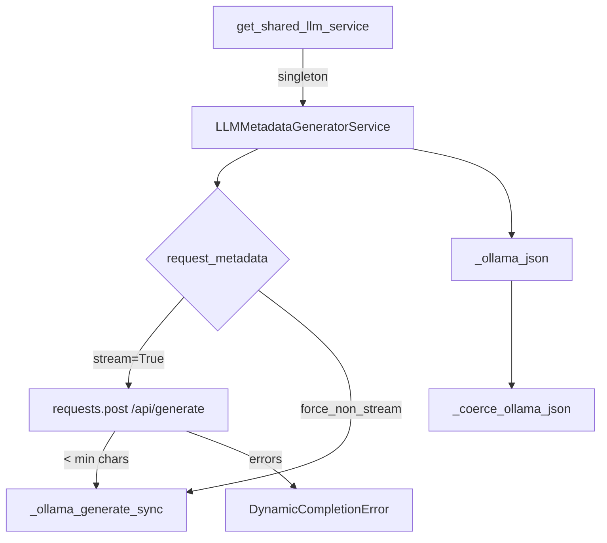
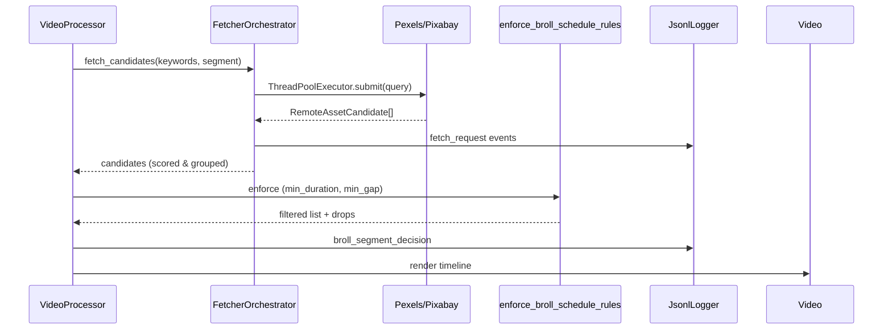

# ARCHITECTURE

## Table des matières
- [Diagramme de service LLM](#diagramme-de-service-llm)
- [Pipeline B-roll](#pipeline-b-roll)
- [Gestion des chemins et I/O](#gestion-des-chemins-et-io)
- [Contrats entre modules](#contrats-entre-modules)
- [Invariants et règles](#invariants-et-regles)

## Diagramme de service LLM

Le service crée un singleton protégé par verrou (`_SHARED_LOCK`) et route chaque segment vers `_ollama_generate_text`, qui tente d'abord le flux streaming (`requests.post`), applique la garde `PIPELINE_LLM_MIN_CHARS`, puis bascule vers `_ollama_generate_sync` en cas de sous-longueur ou de forçage explicit via `PIPELINE_LLM_FORCE_NON_STREAM`.【F:pipeline_core/llm_service.py†L1398-L1669】【F:pipeline_core/llm_service.py†L3876-L3943】

## Pipeline B-roll

`VideoProcessor._insert_brolls_pipeline_core` pilote la boucle segment par segment, nettoie les segments, puis confie la récupération à `FetcherOrchestrator` (requêtes parallèles, scoring, fallback Pixabay). Le plan filtré est passé à `enforce_broll_schedule_rules` qui n'applique aujourd'hui que la durée minimale et l'intervalle, sans anti-repeat ni early skip.【F:video_processor.py†L1843-L1999】【F:pipeline_core/fetchers.py†L200-L520】【F:video_processor.py†L423-L447】

## Gestion des chemins et I/O
```mermaid
flowchart LR
    run_pipeline[run_pipeline.py]
    run_pipeline -->|OUTPUT_FOLDER| Config[config.Config]
    Config -->|Path("output")| FS1[output/]
    Config -->|Path("clips")| FS2[clips/]
    run_pipeline -->|JsonlLogger| Meta[output/meta/broll_pipeline_events.jsonl]
    setup.py -->|os.makedirs| FS1
    setup.py --> FS2
```
- `Config` définit les chemins racine en `pathlib.Path`, utilisés par `run_pipeline` pour créer les dossiers metadata (`output/meta`).【F:config.py†L12-L39】【F:run_pipeline.py†L162-L200】
- `setup.py` duplique la création via `os.makedirs`, ce qui force l'utilisation du CWD et ignore des chemins personnalisés, point à corriger via un `Settings` centralisé.【F:setup.py†L22-L31】
- Les assets temporaires téléchargés par `_download_core_candidate` utilisent `tempfile.NamedTemporaryFile` côté tests, mais la version production conserve les fichiers dans `temp/` avant suppression (non montré ici).

## Contrats entre modules
| Producteur | Consommateur | Contrat | Référence |
|---|---|---|---|
| `TranscriptAnalyzer.analyse` | `VideoProcessor` | Retourne `List[TranscriptSegment]` avec `start`, `end`, `text` non vides. | `pipeline_core/transcript.py` lignes 16-45.【F:pipeline_core/transcript.py†L16-L45】 |
| `LLMMetadataGeneratorService.generate_metadata` | `VideoProcessor` | Fournit `queries` & `broll_keywords` JSON strict (attendu). | `pipeline_core/llm_service.py` lignes 546-618 & 3402-3486.【F:pipeline_core/llm_service.py†L546-L618】【F:pipeline_core/llm_service.py†L3402-L3486】 |
| `FetcherOrchestrator.fetch_candidates` | `VideoProcessor` | Retourne `List[RemoteAssetCandidate]` (provider, url, dimensions, duration). | `pipeline_core/fetchers.py` lignes 203-520.【F:pipeline_core/fetchers.py†L203-L520】 |
| `enforce_broll_schedule_rules` | `VideoProcessor` | Filtre plan B-roll et renvoie `drops` pour reporting. | `video_processor.py` lignes 423-447.【F:video_processor.py†L423-L447】 |
| `JsonlLogger` | Observabilité | Écrit un événement JSON par ligne, utilisé par `run_pipeline` et `VideoProcessor`. | `pipeline_core/logging.py` lignes 34-118.【F:pipeline_core/logging.py†L34-L118】 |

## Invariants et règles
- **LLM** :
  - Toujours appliquer `PIPELINE_LLM_MIN_CHARS` (>=0) sur la réponse streaming, sinon fallback non-stream.【F:pipeline_core/llm_service.py†L1486-L1615】
  - `PIPELINE_LLM_KEEP_ALIVE` injecté dans le payload pour maintenir la session Ollama.【F:pipeline_core/llm_service.py†L1464-L1474】
- **B-roll** :
  - Durée minimale par clip (`min_duration` param) et intervalle (`min_gap`) doivent être respectés ; actuellement seules ces règles sont codées et doivent être enrichies (min start, anti-repeat, min gap configurable).【F:video_processor.py†L423-L447】
  - `FetcherOrchestratorConfig.per_segment_limit` plafonne le nombre de candidats retenus, déterminé par env (`BROLL_FETCH_MAX_PER_KEYWORD`).【F:pipeline_core/configuration.py†L320-L431】

### B-roll invariants

La phase d'ordonnancement applique désormais trois invariants configurables via `BrollSettings` (`video_pipeline.config.settings`).【F:video_pipeline/config/settings.py†L160-L234】 Le module `video_pipeline.broll_rules` filtre les clips fournis par les fetchers afin de :

1. Décaler le premier B-roll après `min_start_s` pour préserver le hook.【F:src/video_pipeline/broll_rules.py†L45-L53】
2. Garantir un intervalle minimal `min_gap_s` entre insertions successives.【F:src/video_pipeline/broll_rules.py†L55-L60】
3. Éviter toute réutilisation d'un asset dans la fenêtre `no_repeat_s`, en journalisant les exclusions `[BROLL]` correspondantes.【F:src/video_pipeline/broll_rules.py†L62-L72】

Ces règles s'exécutent sans impacter les phases de sélection fournisseur : seules les propositions incompatibles sont écartées, assurant la cohérence entre config typée et planification finale.【F:video_processor.py†L360-L405】
- **Chemins** :
  - `JsonlLogger` crée le dossier parent avant écriture, garantissant l'idempotence des runs.【F:pipeline_core/logging.py†L34-L118】
  - `run_pipeline.py` garantit UTF-8 et normalise les variables `ENABLE_PIPELINE_CORE_FETCHER`/providers avant lancement.【F:run_pipeline.py†L40-L200】
