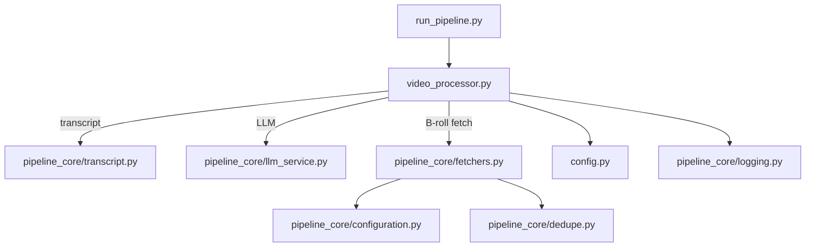

# AUDIT

## Table des matières
- [Vue d'ensemble](#vue-densemble)
- [Carte des modules](#carte-des-modules)
- [Points d'entrée et flux de données](#points-dentree-et-flux-de-donnees)
- [Problèmes détectés](#problemes-detectes)
- [Code vestige et duplication](#code-vestige-et-duplication)
- [Compatibilité Windows / Cloud](#compatibilite-windows--cloud)
- [Performance et robustesse](#performance-et-robustesse)
- [Sécurité & conformité](#securite--conformite)

## Vue d'ensemble
Le dépôt orchestre un pipeline complet de génération de clips verticaux : transcription, extraction d'insights via LLM, requêtes B-roll auprès de Pexels/Pixabay, insertion vidéo et rendu final. Le wrapper CLI `run_pipeline.py` prépare l'environnement (UTF-8, clés API, configuration fetcher) avant de déléguer à `video_processor.VideoProcessor` pour gérer les étapes vidéo, audio et B-roll.【F:run_pipeline.py†L1-L200】【F:video_processor.py†L1843-L1999】

## Résolu — Lot 1 merge
- **Fichiers touchés** : `run_pipeline.py`, `video_pipeline/config/settings.py`, `video_pipeline/config/__init__.py`, `tests/test_config_boot.py`, `config.py`.
- **Décisions clés** : réintroduction du chargeur de configuration typé avec cache process-wide, log `[CONFIG]` idempotent et masquage des secrets, avertissement de dépréciation pour `config.py` afin d'orienter vers l'API unifiée.
- **Suites possibles (Lots 2/3)** : brancher ces settings typés sur la sélection B-roll avancée et enrichir les validations/contrôles dans `pipeline_core.configuration` sans modifier le point d'entrée CLI.

## Carte des modules

## Points d'entrée et flux de données
- **CLI** – `run_pipeline.py` charge les variables d'environnement, sélectionne les providers B-roll et ouvre un logger JSONL pour suivre les événements du pipeline.【F:run_pipeline.py†L64-L200】  
- **UI** – `main.py` expose une interface Tkinter pour lancer `VideoProcessor` avec configurations avancées.【F:main.py†L1-L120】  
- **Flux principal** – `VideoProcessor._insert_brolls_pipeline_core` nettoie les segments, interroge `FetcherOrchestrator`, applique les règles de planning (`enforce_broll_schedule_rules`) puis rend les timelines.【F:video_processor.py†L1843-L1999】【F:video_processor.py†L423-L447】  
- **LLM** – `pipeline_core.llm_service` gère la génération de mots-clés/queries via Ollama : tentative streaming, fallback non-stream, garde `PIPELINE_LLM_MIN_CHARS` et renvoie les artefacts normalisés.【F:pipeline_core/llm_service.py†L1434-L1669】【F:pipeline_core/llm_service.py†L546-L589】  
- **Fetchers** – `FetcherOrchestrator` construit des requêtes simples, parallélise les appels Pexels/Pixabay et réapplique un scoring léger avant retour au planificateur.【F:pipeline_core/fetchers.py†L200-L520】【F:pipeline_core/fetchers.py†L788-L800】

## Problèmes détectés
| Gravité | Description | Impact | Cause racine | Localisation | Proposition de correction |
|---|---|---|---|---|---|
| ⚠️ Critique | `setup.py` imprime des emojis (UTF-8) et du texte multi-ligne → crash `cp1252` lors d'une installation Windows. | Empêche `pip install` sur Windows/PowerShell. | Sorties non ASCII et `print` interactifs dans le script d'installation. | `setup.py` lignes 1-34.【F:setup.py†L1-L34】 | Migrer vers `pyproject.toml` minimal ou remplacer les impressions par ASCII et `encoding='utf-8'`. |
| ⚠️ Critique | Planning B-roll ne bloque pas les inserts avant le hook et n'applique que durée+gap. | B-roll apparaît dès 0 s, brise le hook, répétitions proches. | `enforce_broll_schedule_rules` ignore `no_broll_before_s` et ne suit ni requêtes ni assets. | `video_processor.py` lignes 423-447 & `config.BrollConfig.no_broll_before_s` ignoré.【F:video_processor.py†L423-L447】【F:config.py†L218-L228】 | Étendre la fonction avec (1) contrôle `start < min_start`, (2) mémoire sur requêtes/identifiants pour anti-repeat, (3) prise en compte du gap configurable via settings centralisé. |
| ⚠️ Critique | `pipeline_core/llm_service.py` manipule `sys.path` dynamiquement pour importer `utils` puis exécute du code à l'import. | Installation packagée impossible, collisions modules, comportement non déterministe. | Hack d'import conditionnel sur `PROJECT_ROOT`. | `pipeline_core/llm_service.py` lignes 23-37.【F:pipeline_core/llm_service.py†L23-L38】 | Extraire les dépendances dans un package, supprimer l'injection `sys.path`, exposer une API stable dans `utils`. |
| ⏫ Élevé | Fallback LLM non-stream ne log pas systématiquement la raison (< min chars) ni le modèle utilisé. | Débogage difficile (on ignore si `PIPELINE_LLM_MIN_CHARS` déclenche). | Retour tuple `(text, reason, …)` mais `reason` vidé avant propagation. | `pipeline_core/llm_service.py` lignes 1513-1669.【F:pipeline_core/llm_service.py†L1513-L1669】 | Propager `reason` dans les logs/événements, enrichir `StageEventLogger` avec `llm_reason`. |
| ⏫ Élevé | Construction des requêtes fetcher basique : concatène les 3 premiers mots-clés → répétitions quasi identiques, aucune normalisation sémantique. | Déduplication faible, assets redondants, surcharge quotas. | `_build_queries` ne déaccentue ni ne fusionne les variantes, `_augment_with_synonyms` non utilisé. | `pipeline_core/fetchers.py` lignes 788-800.【F:pipeline_core/fetchers.py†L788-L800】 | Réutiliser `_normalize_queries` + `_augment_with_synonyms`, appliquer TF-IDF et heuristique min gap entre requêtes similaires. |
| ⏬ Moyen | Impression brute `print(f"[FETCH] ...")` dans `_fetch_from_pixabay`. | Bruit console, casse tests capturant stdout. | Logging non centralisé. | `pipeline_core/fetchers.py` lignes 724-733.【F:pipeline_core/fetchers.py†L724-L733】 | Remplacer par `self._logger.info` + `StageEventLogger`. |
| ⏬ Moyen | Nombreux fichiers `video_processor_*.py` (backup/legacy) exposés au PythonPath. | Risque d'import accidentel, confusion développeur, maintenance lourde. | Copies non archivées laissées à la racine. | `video_processor_backup.py`, `video_processor_current_backup.py`, etc.【F:video_processor_backup.py†L1-L40】 | Déplacer dans `archive/` ou supprimer après audit, mettre à jour documentation. |
| ℹ️ Mineur | `setup_directories` écrit toujours dans `cwd` (`clips/`, `output/`) sans paramètre. | Pollution projets multi-app, non idempotent sur chemins absolus. | `os.makedirs` sur strings relatifs. | `setup.py` lignes 22-31.【F:setup.py†L22-L31】 | Centraliser création dossiers via `pathlib.Path` configurable (`Settings`), utiliser `Path.cwd()/...`. |

## Code vestige et duplication
- **Backups** – `video_processor_backup.py`, `video_processor_current_backup.py`, `video_processor.py.backup_*` contiennent des versions entières du pipeline (plus de 10k lignes). Aucune référence import dans le code courant ; uniquement historiques.【F:video_processor_backup.py†L1-L40】
- **Scripts hérités** – `advanced_broll_pipeline.py`, `pipeline_qwen3_8b_unifie.py`, `pipeline_hybride_robuste.py` duplicent la logique B-roll/LLM. Aucun module ne les importe ; ce sont des prototypes obsolètes.
- **Flags non utilisés** – `BrollConfig.enable_micro_moments` & `emotion_*` ne sont jamais lus dans `video_processor.py` (absence de recherche `emotion_broll_mapping`).
- **Variables d'environnement orphelines** – `PIPELINE_LLM_JSON_PROMPT` (override) existe mais aucun test ne valide cette voie ; `PIPELINE_LLM_JSON_TRANSCRIPT_LIMIT` n'est jamais consommé en aval après parsing JSON.【F:pipeline_core/llm_service.py†L1267-L1316】

## Compatibilité Windows / Cloud
- `run_pipeline.py` force UTF-8 sur stdout/stderr (OK) mais `setup.py` reste incompatible cp1252.【F:run_pipeline.py†L40-L48】【F:setup.py†L1-L34】
- Chemins : `Config` définit `Path("clips")` etc., mais plusieurs scripts (ex :`setup.py`) utilisent des `print` avec `/` codé en dur.【F:config.py†L12-L39】【F:setup.py†L22-L31】
- Dépendances natives (OpenCV, ffmpeg) : absence de vérification OS ; `VideoProcessor` assume disponibilité (`cv2`, `ffmpeg`). Aucune détection GPU.
- Cloud : fetchers utilisent `ThreadPoolExecutor` mais pas de timeouts par requête fine ; `request_timeout_s` unique, pas de backoff fournisseur spécifique.【F:pipeline_core/fetchers.py†L253-L307】

## Performance et robustesse
- `FetcherOrchestrator` lance un futur par requête sans limite globale → explosion concurrency si `max_queries` élevé ; nécessite semaphore/bulkhead.【F:pipeline_core/fetchers.py†L253-L307】
- Fallback Pixabay toujours déclenché si `raw_results` vide, même après timeouts partiels → potentiellement double appel inutile.【F:pipeline_core/fetchers.py†L320-L329】
- Absence de cache LLM : `_ollama_generate_text` refait un call complet par segment sans memoization ; `PIPELINE_LLM_KEEP_ALIVE` lu mais pas appliqué au `requests.post` (seulement payload).【F:pipeline_core/llm_service.py†L1464-L1474】
- `enforce_broll_schedule_rules` ne trace pas les rejets (sauf renvoi `drops`) → pas de log pour aider tuning.【F:video_processor.py†L423-L447】

## Sécurité & conformité
- API keys lues via `os.getenv` et masquées dans le banner CLI, mais `FetcherOrchestrator` logge les requêtes sans masquage lorsque `_logger` absent (utilise `print`).【F:run_pipeline.py†L50-L155】【F:pipeline_core/fetchers.py†L724-L733】
- Pas de chiffrement ou nettoyage des fichiers temporaires B-roll (téléchargés dans `temp/` puis supprimés). Vérifier conformité RGPD selon contenus.
- Aucun mécanisme pour purger les logs JSONL (peuvent contenir transcripts). `JsonlLogger` écrit en clair sans rotation.【F:pipeline_core/logging.py†L34-L118】
