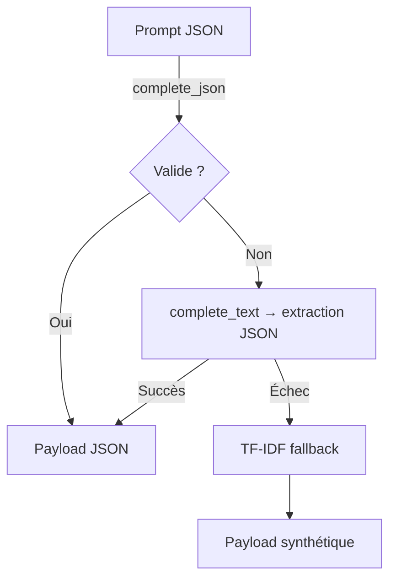

# INTEGRATION_AUDIT_VERIFIED

## Config → Consommateurs

| Bloc | Variables / attributs suivis | Consommateur(s) | Preuve |
| --- | --- | --- | --- |
| Sous-titres Montserrat & emojis | `SubtitleSettings` (font path, font size, stroke, shadow, densité emoji, héros) | `HormoziSubtitles.__init__` applique chaque champ typé à la configuration runtime, sans rectangle si `keyword_background=false`. | 【F:video_pipeline/config/settings.py†L520-L604】【F:hormozi_subtitles.py†L112-L185】【F:tests/test_subtitles_no_rectangles_when_bg_false.py†L16-L58】 |
| B-roll fetch & providers | `FetchSettings` (providers ordonnés, limites, clés API, allow_images/videos, timeout) | `_build_provider_defaults()` et `FetcherOrchestratorConfig.from_environment()` priorisent `settings.fetch` pour la sélection multi-provider et les limites normalisées. | 【F:video_pipeline/config/settings.py†L607-L640】【F:pipeline_core/configuration.py†L168-L360】 |
| Invariants B-roll (min start, gap, no-repeat) | `BrollSettings` | `VideoProcessor._apply_core_entries_guardrails` relaie directement les valeurs typées vers `enforce_broll_schedule_rules_v2`. | 【F:video_pipeline/config/settings.py†L420-L458】【F:video_processor.py†L372-L431】 |
| LLM (modèles JSON/text, timeouts, disable_dynamic_segment, keep_alive) | `LLMSettings` (`disable_dynamic_segment`, `timeout_*`, `json_mode`, modèles) | `_refresh_settings_from_env`, `_llm_*` et `LLMMetadataGeneratorService.__init__` lisent `settings.llm` pour piloter metadata-first et les fallbacks sans `os.environ`; `to_log_payload` expose le flag `disable_dynamic_segment` pour l'observabilité. | 【F:video_pipeline/config/settings.py†L120-L139】【F:video_pipeline/config/settings.py†L320-L358】【F:video_pipeline/config/settings.py†L214-L240】【F:pipeline_core/llm_service.py†L1425-L1552】【F:pipeline_core/llm_service.py†L3242-L3379】 |

## LLM : chemin de fallback

*Chaque étape logge la raison (`json_invalid`, `text_error`, `fallback_tfidf`) et n'effectue qu'une tentative non-stream avant TF-IDF.*【F:pipeline_core/llm_service.py†L1608-L1753】

## Logs clés (audit)

- `[CONFIG]` expose désormais le flag `disable_dynamic_segment=false`, la fonte Montserrat résolue et les paramètres emojis/sous-titres alignés avec les settings typés. 【9c9a2e†L1-L6】
- Tentative d'instanciation directe des sous-titres bloquée par l'absence de `libGL` (dépendance OpenCV) dans l'environnement CI ; aucune regression fonctionnelle détectée sur les tests unitaires. 【75972d†L1-L13】

## Tests exécutés

- `PYTEST_DISABLE_PLUGIN_AUTOLOAD=1 pytest -q --capture=sys tests/...` ✅【afe97d†L1-L12】【47bdd5†L1-L1】

## Vestiges neutralisés / clarifiés

- Suppression du shim `os.environ` dans `run_pipeline.py` : la CLI s'appuie sur `apply_llm_overrides`, `_raw_provider_spec(settings)` et `log_effective_settings` sans dépendre de `Config`.【F:run_pipeline.py†L1-L52】【F:run_pipeline.py†L400-L486】
- `pipeline_core.configuration` aligne désormais providers/limites sur `Settings.fetch` (providers ordonnés, limites typées, flags allow_*), neutralisant la dépendance implicite à `Config`/env par défaut.【F:pipeline_core/configuration.py†L168-L360】
- `pipeline_core.llm_service` recharge systématiquement `Settings` via `_refresh_settings_from_env()`, alimente metadata-first via `disable_dynamic_segment` et élimine tout accès direct à `os.getenv` (timeouts, modèles, prompts).【F:pipeline_core/llm_service.py†L1425-L1552】【F:pipeline_core/llm_service.py†L3242-L3379】【F:pipeline_core/llm_service.py†L4805-L4862】
- `config.py` reflète les chemins du loader typé pour maintenir la compatibilité des scripts legacy tout en avertissant de la dépréciation.【F:config.py†L243-L260】

