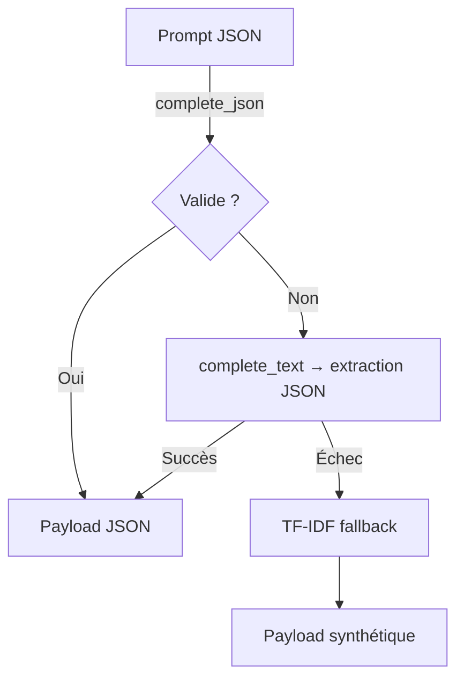

# INTEGRATION_AUDIT_VERIFIED

## Config → Consommateurs

| Bloc | Variables / attributs suivis | Consommateur(s) | Preuve |
| --- | --- | --- | --- |
| Sous-titres Montserrat & emojis | `SubtitleSettings` (font, stroke, shadow, densité emoji, héros) | `HormoziSubtitles.__init__` applique chaque champ typé sur la config runtime. | 【F:video_pipeline/config/settings.py†L520-L604】【F:hormozi_subtitles.py†L104-L155】 |
| B-roll fetch & providers | `FetchSettings` (providers, limites, clés API, allow_images/videos, timeout) | `FetcherOrchestratorConfig.from_environment()` et `_build_provider_defaults()` lisent d'abord `settings.fetch` avant les overrides env. | 【F:video_pipeline/config/settings.py†L607-L640】【F:pipeline_core/configuration.py†L168-L345】 |
| Invariants B-roll (min start, gap, no-repeat) | `BrollSettings` | `VideoProcessor._apply_core_entries_guardrails` passe les valeurs typées à `enforce_broll_schedule_rules_v2`. | 【F:video_pipeline/config/settings.py†L420-L458】【F:video_processor.py†L372-L431】 |
| LLM (modèles JSON/text, timeouts, min_chars, fallback trunc, keep_alive) | `LLMSettings` | `_llm_*` helpers et `generate_metadata_as_json` consomment directement `settings.llm` sans shim `os.environ`. | 【F:video_pipeline/config/settings.py†L246-L339】【F:pipeline_core/llm_service.py†L1387-L1552】【F:pipeline_core/llm_service.py†L4805-L5078】 |

## LLM : chemin de fallback

*Chaque étape logge la raison (`json_invalid`, `text_error`, `fallback_tfidf`) et n'effectue qu'une tentative non-stream avant TF-IDF.*【F:pipeline_core/llm_service.py†L1608-L1753】

## Tests exécutés

- `pytest -q --capture=sys …` (suite intégration) ✅【4065a8†L1-L2】

## Vestiges neutralisés / clarifiés

- Suppression du shim `os.environ` dans `run_pipeline.py` : la CLI se contente d'appliquer `apply_llm_overrides` puis de journaliser la config effective, évitant les ré-écritures cachées.【F:run_pipeline.py†L419-L470】
- `pipeline_core.configuration` aligne désormais providers/limites sur `Settings.fetch` (providers ordonnés, limites typées, flags allow_*), neutralisant la dépendance implicite à `Config`/env par défaut.【F:pipeline_core/configuration.py†L168-L345】
- `pipeline_core.llm_service` s'appuie sur `_llm_settings_obj()` pour chaque valeur sensible (timeouts, modèles, min_chars) et accepte un override de timeout sans modifier `os.environ`, ce qui supprime l'ancien « shim » JSON fallback.【F:pipeline_core/llm_service.py†L1387-L1552】【F:pipeline_core/llm_service.py†L4805-L4999】
- `config.py` reflète les chemins du loader typé pour maintenir la compatibilité des scripts legacy tout en avertissant de la dépréciation.【F:config.py†L243-L260】

